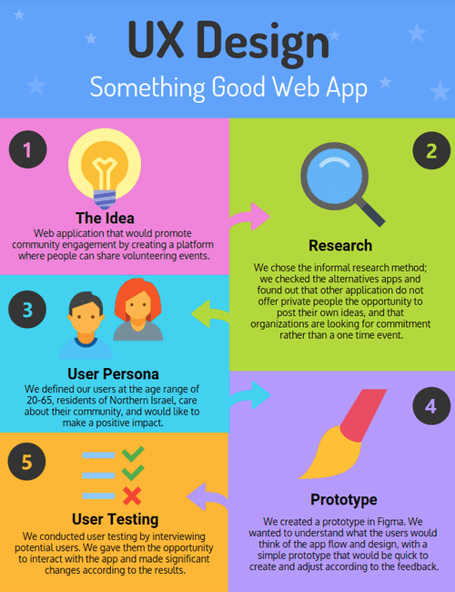

# UX Design - Something Good Web App

## Showcase a UX Design process for the web application **Something Good**

### Visit the page [here](https://veredrec.github.io/UX-Design/)

The web page details the process of building a user centered web application, with the following phases:

:bulb: Initial Idea

:question: Defining the Problem

:mag: Research

:person_with_blond_hair: Creating User Persona

:black_nib: Wireframe - Sketch

:art: Prototype - using Figma

:chart_with_upwards_trend: User Testing and Rethinking the design

:computer: Code - MVP

:iphone: Final Product

The process was made by [Vered Rekanati](https://github.com/veredrec) & [Sajeda Zoabi](https://github.com/sajedazoabi), as a part of Founders and Coders Full Stack Web Development Bootcamp, Israel, 2017

To see the final product, please visit [this link](https://somethingood.herokuapp.com/). We highly recommend browsing the website using a mobile device!
